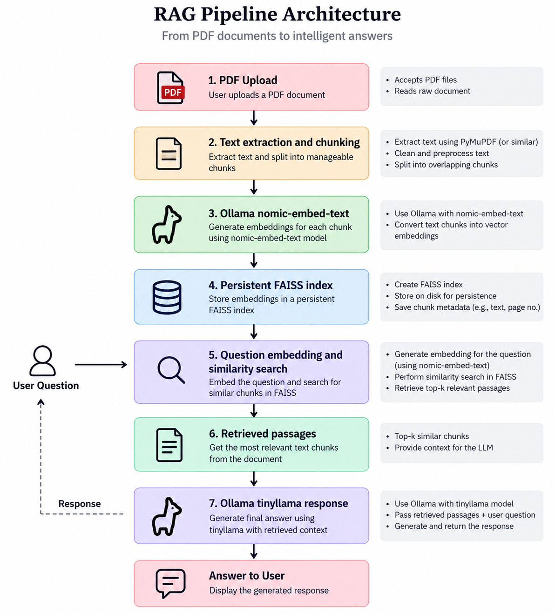

# 📝 Build Your Local RAG System with LLMs

Welcome to **Local PDF Chatbot**, a local Retrieval-Augmented Generation (RAG) system with a FAISS index and native Ollama for embeddings and generation.

### 🌟 Key Features:

- **Privacy-Friendly Document Search:** Search through personal documents without uploading them to the cloud.

- **Local vector search with FAISS:** Persists document vectors on disk without a database container.

- **Native Ollama inference:** Uses `nomic-embed-text` and `llama3.2:3b` outside the Python process.

- **Easy Integration with LLMs:** Leverage local LLMs for personalized, context-aware responses.

### Limitations

- Ollama must be installed on the host machine.

- Response speed depends on available CPU, GPU, and memory.

- Uploaded files are local to the deployment machine.

- There is currently no built-in authentication.

- Scanned image-only PDFs may require additional OCR integration.

- The generation temperature is passed to Ollama for grounded responses.

## 🏗️ Architecture

The system follows a Retrieval-Augmented Generation (RAG) pipeline. Uploaded documents are processed locally, converted into embeddings, stored in a persistent FAISS index, and retrieved when a user asks a question.

