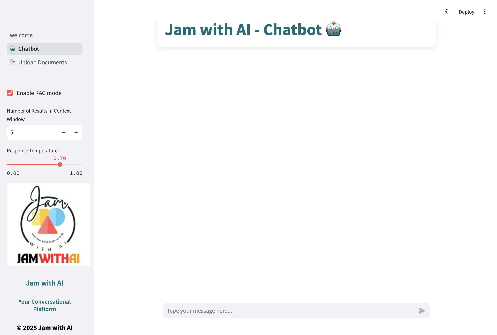

# 📝 Build Your Local RAG System with LLMs

Welcome to **Panda's Chatbot**, a local Retrieval-Augmented Generation (RAG) system with a FAISS index and native Ollama for embeddings and generation.

### 🌟 Key Features:
- **Privacy-Friendly Document Search:** Search through personal documents without uploading them to the cloud.
- **Local vector search with FAISS:** Persists document vectors on disk without a database container.
- **Native Ollama inference:** Uses `nomic-embed-text` and `llama3.2:3b` outside the Python process.
- **Easy Integration with LLMs**: Leverage local LLMs for personalized, context-aware responses.

### 🚀 Get Started
1. Clone the repo: `git clone https://github.com/JAMwithAI/build_your_local_RAG_system.git`
2. Install dependencies: `pip install -r requirements.txt`
3. Install and start Ollama on the host, then pull `nomic-embed-text` and `tinyllama`.
4. Run the Streamlit app: `streamlit run Welcome.py`

